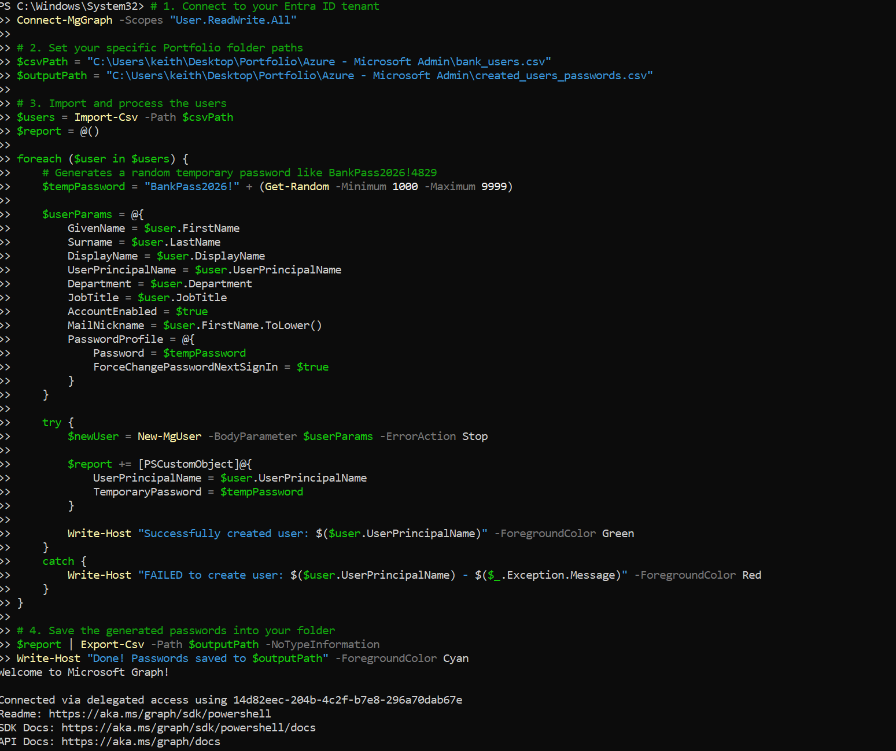
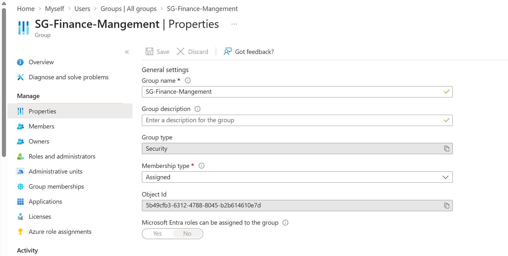
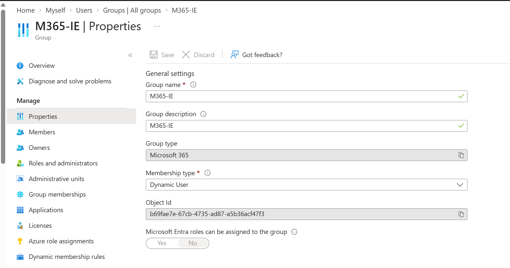
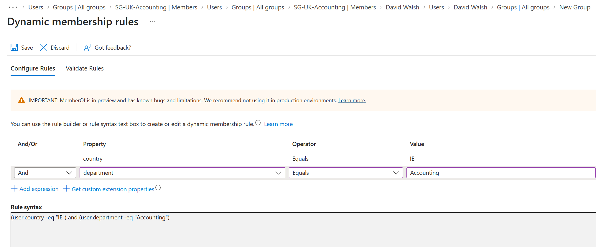
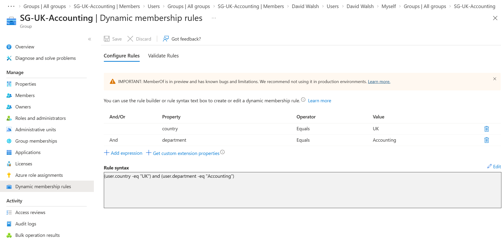
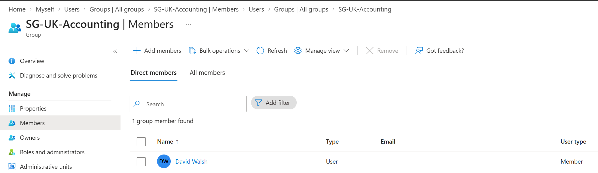
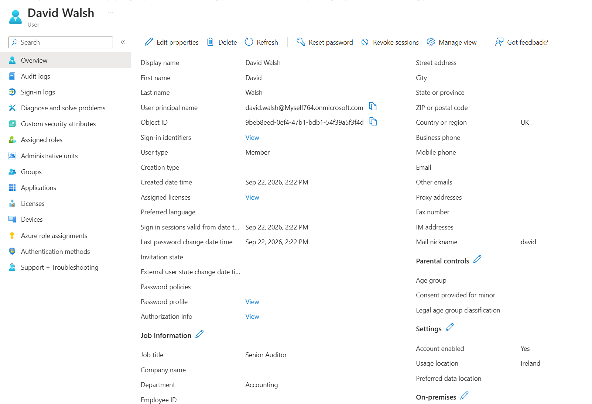
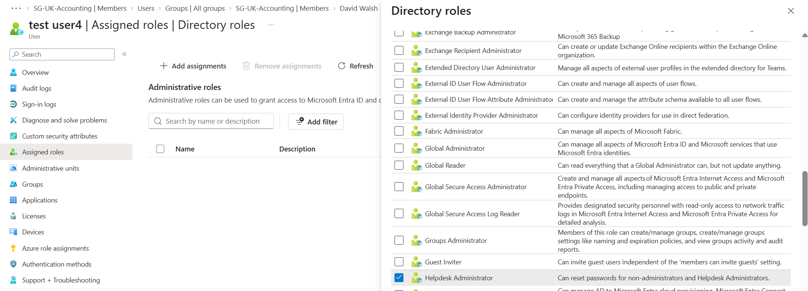
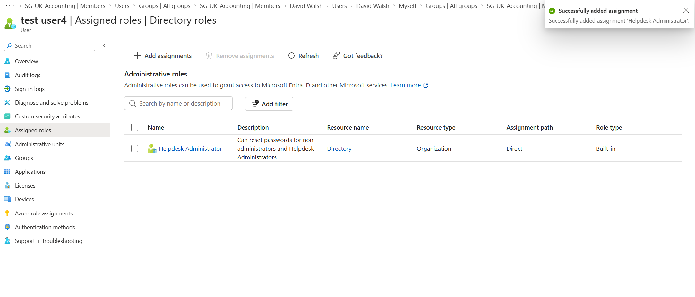

<h1>Entra ID / Microsoft 365 Admin Lab</h1>

<h2>Description</h2>
This project builds out a simulated corporate identity environment in Microsoft Entra ID, modelled on a small bank. Using PowerShell and the Microsoft Graph SDK, I bulk-created users, then set up Microsoft 365 groups and security groups to manage access across departments (IT, Accounting, Banking, Compliance) and regions (Ireland, UK, USA). I configured a mix of dynamic and assigned group membership, and practised core Microsoft 365 admin tasks such as role assignment, licence management, and troubleshooting.
 

<h2>Skills Demonstrated</h2>

- Bulk user creation and management via PowerShell and Microsoft Graph
- Microsoft 365 and security group design (region and department based)
- Dynamic group membership rules based on directory attributes (Country, Department)
- Least-privilege role assignment (Helpdesk Administrator vs Global Administrator)
- Licence management (Microsoft 365 E5, Entra ID P2)
- Error handling and troubleshooting PowerShell/Graph scripts

<h2>Utilities Used</h2>

- <b>Microsoft Entra admin center</b>
- <b>Microsoft Graph PowerShell SDK</b>
- <b>Microsoft 365 admin center</b>
- <b>Roles & administrators</b>

<h2>Environments Used</h2>

- <b>Microsoft Entra ID</b> tenant (Microsoft 365 E5 / Entra ID P2 trial)
- <b>PowerShell 7</b>

<h2>Scripts </h2>  

- [`create-users.ps1`](scripts/create-users.ps1) — bulk-creates users in Entra ID from a CSV using Microsoft Graph PowerShell
- [`add-group-members.ps1`](scripts/add-group-members.ps1) — assigns users to security groups from a CSV
- [`update-user-attributes.ps1`](scripts/update-user-attributes.ps1) — updates Country, Department and UsageLocation for existing users
  
<h2>Lab walk-through:</h2>

Users bulk-created via PowerShell and Microsoft Graph:  

 

 
Microsoft 365 and security groups created:  

  
 
 
Dynamic membership rule configured (Country and Department):  

  
 
 
Group membership auto-populated by the dynamic rule:  

  
 
 
Helpdesk Administrator role assigned to a test user:  

